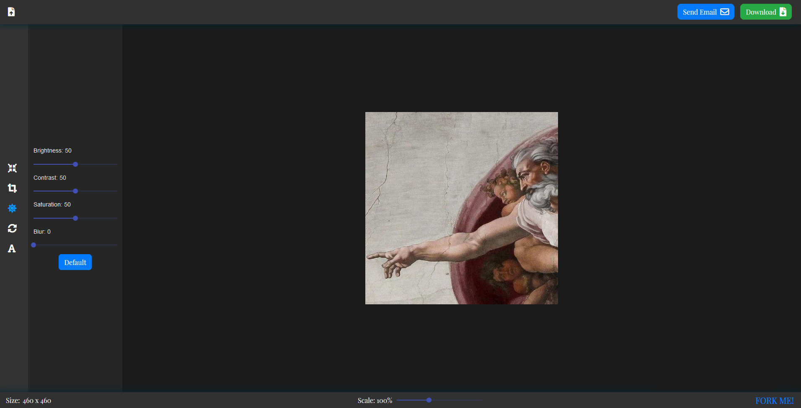

## Photo Editor

A single page web application which enables users to edit their images. Build with React.

## Live Demo

https://photoeditor-b9663.firebaseapp.com/

## Watch YouTube Video

https://www.youtube.com/watch?v=53omb2FfuU4

## User Stories

-   [x] User can upload images via `drag and drop`, or via classic File Uploader.
-   [x] User can `resize` images.
-   [x] User can `crop` images.
-   [x] User can change `Brightness`, `Contrast`, `Saturation` and `Blur` of images.
-   [x] User can `rotate` and `flip` images.
-   [x] User can `add text` to images.
-   [x] User can `download` the edited version of an image, or send it via `e-mail`.
-   [x] If an image is too big to fit the screen, app zooms out automatically. Also, user can change this `scaling factor` by using the slider in the footer.
-   [x] Edited version of images are stored in the `local storage`. Thus, users can continue editing where they left off, when they return.

## TODO

-   [ ] Validate inputs.
